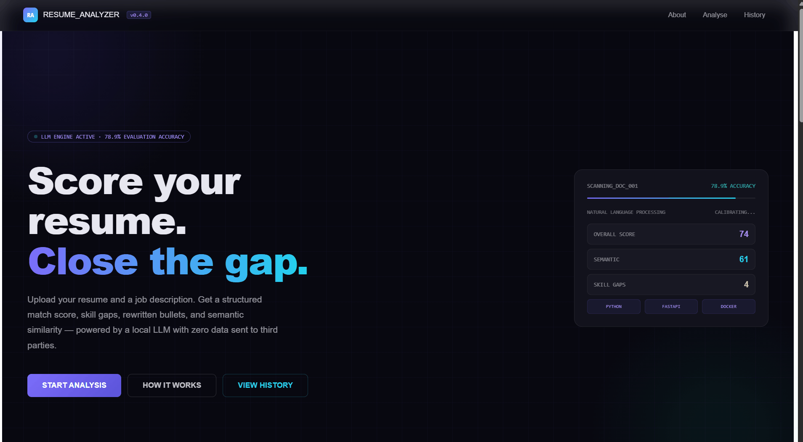
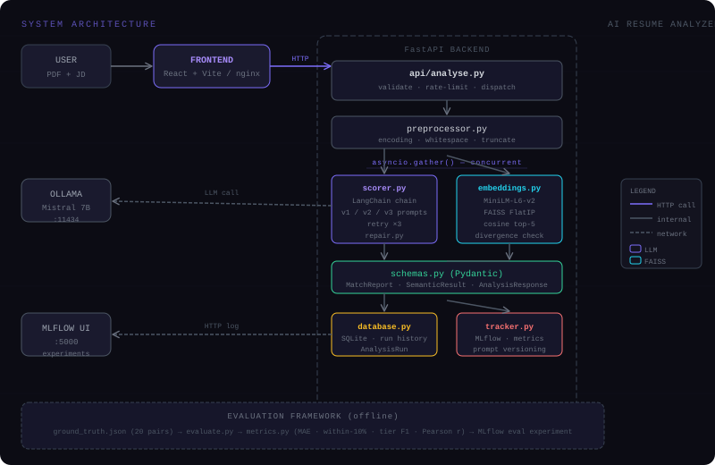

# AI Resume & Job Match Analyzer


> Upload a resume PDF and a job description. Get a structured match score, skill gaps, bullet rewrites, and semantic similarity — all powered by a local LLM with zero ongoing cost and zero data sent to third parties.

---

## Demo

<!-- Record a GIF with ScreenToGif (free, Windows) and replace this line -->


---

## Architecture



**Key engineering decisions:**

- LLM and FAISS semantic scoring run **concurrently** via `asyncio.gather()` + `ThreadPoolExecutor` — both signals computed simultaneously, not sequentially
- **3-strategy JSON repair layer** (`repair.py`) salvages malformed LLM responses — repair rate 26% on Mistral with zero hard failures
- **3 prompt templates** tracked separately in MLflow — few-shot (v3) outperforms baseline by 6.7pp on within-10 accuracy and 24.7% lower MAE
- **Rate limiting** via `slowapi` — 10 requests/min per IP
- Fully **Dockerised** — one `docker-compose up` starts all 4 services

---

## What it produces

| Output | Description |
|--------|-------------|
| **Overall match score** (0–100) | Calibrated LLM score with plain-English reasoning |
| **Dimension scores** | Skills, experience, and keyword match scored separately |
| **Skill gaps** | Ordered by importance with concrete suggestions |
| **Bullet rewrites** | Rewrites weak resume bullets to match the JD's language |
| **Semantic similarity** | Independent FAISS + MiniLM score alongside the LLM score |
| **Divergence detection** | Flags and explains when the two signals disagree |
| **Run history** | Every analysis saved to SQLite, browsable in the UI |
| **MLflow tracking** | All scores, prompt versions, repair rate, and latency per run |

---

## Evaluation results

Measured against a **20-pair human-labelled ground truth dataset** spanning strong, moderate, and weak resume-JD matches across technical roles.

| Metric | v1 baseline | v2 chain-of-thought | v3 few-shot ✓ |
|--------|-------------|---------------------|----------------|
| MAE ↓ | 10.83 | 10.35 | **8.16** |
| Within-10 accuracy ↑ | 72.2% | 70.0% | **78.9%** |
| Tier accuracy ↑ | 77.8% | **85.0%** | 73.7% |
| Macro F1 ↑ | 0.756 | **0.839** | 0.658 |
| Pearson r ↑ | **0.929** | 0.806 | 0.916 |
| Repair rate ↓ | **11.1%** | 45.0% | 26.3% |
| Avg latency ↓ | 12.58s | 11.67s | **10.09s** |

**v3 (few-shot) selected as default** — best MAE, highest within-10 accuracy, and fastest latency. v2 is the stronger choice when tier classification matters over score precision.

**Known limitation:** all three prompts show upward bias on clearly unqualified candidates (~25–28pt overestimation). Documented in `ARCHITECTURE.md`.

---

## Getting started

### Local (recommended for development)

**Prerequisites:** Python 3.11+, Node 18+, [Ollama](https://ollama.com)

```bash
# 1. Pull the model (one-time, ~4GB)
ollama pull mistral
ollama serve          # keep running in its own terminal

# 2. Backend
cd backend
python -m venv venv
source venv/bin/activate   # Windows: venv\Scripts\activate
pip install -r requirements.txt
cp .env.example .env
uvicorn app.main:app --reload
# → http://localhost:8000/docs

# 3. Frontend (new terminal)
cd frontend
npm install
npm run dev
# → http://localhost:5173
```

### Docker Compose (all 4 services)

```bash
cp backend/.env.example backend/.env
docker-compose up --build
```

| Service | URL |
|---------|-----|
| Frontend | http://localhost:5173 |
| API + Swagger UI | http://localhost:8000/docs |
| MLflow UI | http://localhost:5000 |

First run pulls Mistral (~4GB) automatically.

### Run the evaluation

```bash
cd backend

# Dry run — instant, no LLM calls, confirms pipeline works
python -m evaluation.evaluate --dry-run

# Single prompt
python -m evaluation.evaluate --prompt v3

# All 3 prompts (~60 min on Mistral)
python -m evaluation.evaluate
```

Results saved to `evaluation/results/` as JSON + CSV and logged to the `resume-analyzer-eval` MLflow experiment.

---

## API endpoints

```
POST /analyse/upload         Upload PDF + job description → full report
POST /analyse/text           Same but accepts plain text (no PDF needed)
GET  /analyse/history        All past runs, newest first
GET  /analyse/history/{id}   Full stored report for one run
GET  /analyse/metrics        Aggregate stats (avg score, total runs, breakdown)
GET  /analyse/health         Liveness check
```

All endpoints documented interactively at `/docs`.

---

## Prompt versions

| Version | Strategy | MAE | Within-10 | Notes |
|---------|----------|-----|-----------|-------|
| `v1` | Direct instruction + JSON schema | 10.83 | 72.2% | Lowest repair rate (11%) |
| `v2` | Chain-of-thought — step by step | 10.35 | 70.0% | Best tier F1 (0.839) |
| `v3` | Few-shot example | **8.16** | **78.9%** | Default — best accuracy + fastest |

---

## Project structure

```
resume-analyzer/
├── .github/workflows/
│   ├── ci.yml                 # tests + lint + frontend build on every push
│   └── deploy.yml             # build → ACR → Azure Container Apps on main
├── docs/
│   └── architecture-diagram.svg
├── backend/
│   ├── app/
│   │   ├── api/analyse.py     # routes · rate limiting · concurrent dispatch
│   │   ├── core/
│   │   │   ├── config.py      # pydantic-settings · lru_cache
│   │   │   ├── database.py    # SQLite · AnalysisRun · run history
│   │   │   └── repair.py      # 3-strategy JSON repair · field patching · list caps
│   │   ├── models/schemas.py  # MatchReport · SemanticResult · AnalysisResponse
│   │   ├── services/
│   │   │   ├── embeddings.py  # FAISS FlatIP · MiniLM-L6-v2 · divergence
│   │   │   ├── parser.py      # PDF → text → overlapping chunks
│   │   │   ├── preprocessor.py # unicode · whitespace · truncation
│   │   │   ├── scorer.py      # LangChain chain · 3 prompts · retry
│   │   │   └── tracker.py     # MLflow per-run logging
│   │   └── main.py            # app boot · CORS · rate limiter · lifespan
│   ├── evaluation/
│   │   ├── ground_truth.json  # 20-pair human-labelled dataset
│   │   ├── metrics.py         # MAE · within-N · tier F1 · Pearson r
│   │   ├── evaluate.py        # runner · MLflow logging · JSON/CSV output
│   │   └── results/           # generated eval output (gitignored)
│   └── tests/
│       ├── test_week1.py      # 10 — parser · schemas · scorer
│       ├── test_week2.py      # 26 — preprocessor · repair · retry · integration
│       ├── test_week3.py      # 26 — FAISS · embeddings · divergence
│       └── test_week6.py      # 25 — MAE · within-N · F1 · Pearson
├── frontend/
│   ├── src/
│   │   ├── App.jsx            # routing: landing → analyse → history
│   │   ├── styles.js          # CSS variables and class definitions
│   │   ├── utils.jsx          # helpers: scoreColor · scoreLabel · formatDate
│   │   └── components/
│   │       ├── LandingPage.jsx  # dark-theme marketing page with live eval data
│   │       ├── UploadForm.jsx   # drag-and-drop PDF upload
│   │       ├── ResultPanel.jsx  # score ring · gaps · bullet rewrites · keywords
│   │       ├── ScoreRing.jsx    # animated SVG score ring + dimension bars
│   │       └── HistoryTab.jsx   # run list + slide-in detail drawer
│   ├── Dockerfile             # 2-stage: node builder → nginx
│   └── nginx.conf             # SPA routing + /analyse proxy
├── backend/Dockerfile         # non-root user · healthcheck · 2 workers
├── docker-compose.yml         # local dev (4 services + live reload)
├── docker-compose.prod.yml    # production (ACR images, no volumes)
├── ARCHITECTURE.md            # system design · data models · concurrency
├── CHANGELOG.md               # structured history of all 8 weeks
├── PORTFOLIO.md               # recruiter-facing project summary
└── DEPLOY.md                  # Azure setup guide
```

---

## Test suite

```bash
cd backend && pytest tests/ -v
```

```
87 tests — 4 files — all mocked (no real LLM or network calls required)

test_week1.py   10 — PDF parsing, chunking, Pydantic validation, scorer pipeline
test_week2.py   26 — preprocessor, JSON repair, retry logic, HTTP integration
test_week3.py   26 — FAISS index, embeddings, semantic scoring, divergence
test_week6.py   25 — MAE, within-N accuracy, tier F1, Pearson r, full_report
```

---

## Environment variables

| Variable | Local default | Docker |
|----------|--------------|--------|
| `LLM_PROVIDER` | `ollama` | same |
| `LLM_MODEL` | `mistral` | same |
| `OLLAMA_BASE_URL` | `http://localhost:11434` | `http://ollama:11434` |
| `OPENAI_API_KEY` | — | set if using OpenAI |
| `MLFLOW_TRACKING_URI` | `./mlruns` | `http://mlflow:5000` |
| `MLFLOW_EXPERIMENT_NAME` | `resume-analyzer` | same |

---

## Using OpenAI instead of Ollama

```env
LLM_PROVIDER=openai
LLM_MODEL=gpt-3.5-turbo
OPENAI_API_KEY=sk-...
```

Cost: ~$0.002 per analysis. Running 100 analyses ≈ $0.20.

---

## Roadmap

- [x] Week 1–2 — Core LLM pipeline: PDF parsing, structured output, 3-strategy repair, retry logic
- [x] Week 3 — FAISS semantic similarity: MiniLM embeddings, cosine scoring, divergence detection
- [x] Week 4 — Full backend: rate limiting, history/metrics endpoints, concurrent asyncio scoring
- [x] Week 5 — React frontend: landing page, drag-and-drop upload, score ring, history drawer
- [x] Week 6 — Evaluation framework: 20-pair ground truth, 3-prompt comparison, MLflow metrics
- [x] Week 7 — CI/CD: GitHub Actions (test + lint + build), Docker multi-stage builds, Azure-ready
- [x] Week 8 — Polish: architecture diagram, CHANGELOG, PORTFOLIO.md, .gitignore, final README

---

## Further reading

- [`ARCHITECTURE.md`](ARCHITECTURE.md) — request lifecycle, data models, concurrency model, repair pipeline
- [`PORTFOLIO.md`](PORTFOLIO.md) — recruiter-facing summary with interview talking points
- [`CHANGELOG.md`](CHANGELOG.md) — full development history
- [`DEPLOY.md`](DEPLOY.md) — Azure deployment guide

---

## Licence

MIT
