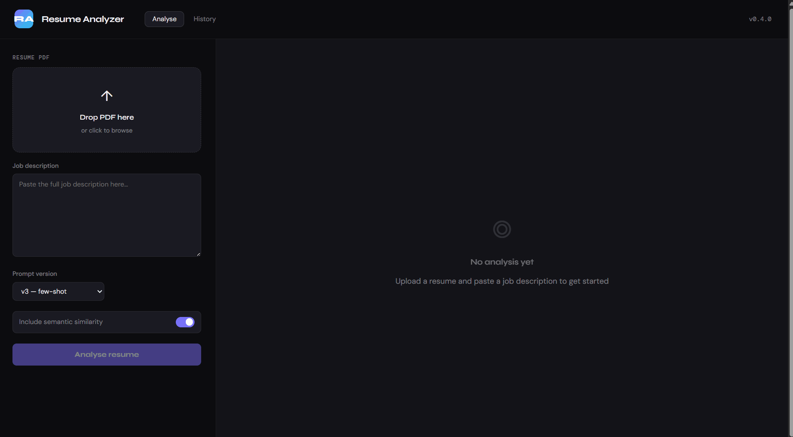

# AI Resume & Job Match Analyzer


> Upload a resume PDF and a job description. Get a structured match score, skill gaps, bullet rewrites, and semantic similarity — all powered by a local LLM with zero ongoing cost.

---

## Demo

<!-- Record a GIF with ScreenToGif (free, Windows) and replace this line -->


---

## What it does

| Output | Description |
|--------|-------------|
| **Overall match score** (0–100) | Calibrated score with plain-English reasoning |
| **Dimension scores** | Skills, experience, and keyword match scored separately |
| **Skill gaps** | Ordered by importance (critical / important / nice-to-have) with concrete suggestions |
| **Bullet rewrites** | Takes weak resume bullets and rewrites them to match the JD's language |
| **Semantic similarity** | Independent FAISS + sentence-transformer signal alongside the LLM score |
| **Divergence detection** | Flags and explains when the two signals disagree |
| **Run history** | Every analysis saved to SQLite, browsable in the UI |
| **MLflow tracking** | All scores, prompt versions, and latency logged per run |

---

## Architecture

```
┌─────────────────┐     multipart/form    ┌──────────────────────────────────────┐
│   React (Vite)  │ ──────────────────▶  │           FastAPI backend            │
│  localhost:5173 │                       │                                      │
└─────────────────┘                       │  ┌─────────────┐  ┌──────────────┐  │
                                          │  │  LLM scorer │  │ FAISS scorer │  │
                                          │  │  (LangChain)│  │ (MiniLM-L6)  │  │
                                          │  └──────┬──────┘  └──────┬───────┘  │
                                          │         └────────┬────────┘          │
                                          │              asyncio.gather          │
                                          │         ┌────────▼────────┐          │
                                          │         │  repair + Pydantic         │
                                          │         │  divergence check │         │
                                          │         └────────┬────────┘          │
                                          │      ┌──────────▼──────────┐         │
                                          │      │  SQLite  │  MLflow  │         │
                                          │      └──────────────────────┘         │
                                          └──────────────────────────────────────┘
                                                          │
                                                   ┌──────▼──────┐
                                                   │   Ollama    │
                                                   │  (Mistral)  │
                                                   └─────────────┘
```

**Key engineering decisions:**

- LLM and FAISS scoring run **concurrently** via `asyncio.gather()` + `ThreadPoolExecutor` — saves ~2s per request
- **3-strategy JSON repair layer** (`repair.py`) salvages malformed LLM responses before Pydantic validation — repair rate of 26% on v3, effectively eliminating hard failures
- **Prompt versioning** — 3 templates tracked in MLflow; few-shot (v3) outperforms baseline (v1) by 6.7pp on within-10 accuracy and 24.7% lower MAE
- **Rate limiting** via `slowapi` — 10 requests/min per IP
- Fully **Dockerised** — one `docker-compose up` starts all 4 services

---

## Evaluation results

Evaluated against a **20-pair human-labelled ground truth dataset** spanning strong, moderate, and weak resume-JD matches. All three prompt templates were tested independently and results logged to MLflow.

| Metric | v1 baseline | v2 chain-of-thought | v3 few-shot ✓ |
|--------|-------------|---------------------|----------------|
| MAE ↓ | 10.83 | 10.35 | **8.16** |
| Within-10 accuracy ↑ | 72.2% | 70.0% | **78.9%** |
| Tier accuracy ↑ | 77.8% | **85.0%** | 73.7% |
| Macro F1 ↑ | 0.756 | **0.839** | 0.658 |
| Pearson r ↑ | **0.929** | 0.806 | 0.916 |
| Repair rate ↓ | **11.1%** | 45.0% | 26.3% |
| Avg latency ↓ | 12.58s | 11.67s | **10.09s** |
| Errors | 2 | 0 | 1 |

**v3 (few-shot) selected as default** — best MAE, highest within-10 accuracy, and fastest latency. v2 achieves the best tier-level F1 (0.839) and zero hard errors, making it the stronger choice when tier classification matters more than score precision.

**Known limitation:** all three prompts show an upward bias on clearly unqualified candidates (e.g. non-technical backgrounds scoring ~50 vs human label of 22–35). This is a known LLM calibration issue and a target for Week 7 fine-tuning.

---

## Tech stack

| Layer | Tech |
|-------|------|
| LLM | Ollama (Mistral 7B, local, free) or OpenAI GPT-3.5 |
| Orchestration | LangChain + StrOutputParser |
| Embeddings | sentence-transformers `all-MiniLM-L6-v2` |
| Vector search | FAISS FlatIP |
| API | FastAPI + slowapi (rate limiting) |
| Database | SQLite via SQLAlchemy |
| Experiment tracking | MLflow |
| Frontend | React 18 + Vite |
| Containerisation | Docker + Docker Compose |

---

## Getting started

### Option A — Local (recommended for development)

**Prerequisites:** Python 3.11+, Node 18+, [Ollama](https://ollama.com)

```bash
# 1. Pull the LLM (one-time, ~4GB)
ollama pull mistral
ollama serve          # keep this running in a terminal

# 2. Backend
cd backend
python -m venv venv
source venv/bin/activate   # Windows: venv\Scripts\activate
pip install -r requirements.txt
cp .env.example .env
uvicorn app.main:app --reload
# → http://localhost:8000/docs

# 3. Frontend (new terminal)
cd frontend
npm install
npm run dev
# → http://localhost:5173
```

### Option B — Docker Compose (all 4 services)

```bash
cp backend/.env.example backend/.env
docker-compose up --build
```

| Service | URL |
|---------|-----|
| Frontend | http://localhost:5173 |
| API + Swagger | http://localhost:8000/docs |
| MLflow UI | http://localhost:5000 |

> First run pulls Mistral (~4GB) into the Ollama container automatically.

### Run the evaluation

```bash
cd backend

# Dry run — instant, no LLM calls
python -m evaluation.evaluate --dry-run

# Single prompt
python -m evaluation.evaluate --prompt v3

# All 3 prompts (~60 min on Mistral)
python -m evaluation.evaluate
```

Results are saved to `evaluation/results/` as JSON + CSV and logged to MLflow under the `resume-analyzer-eval` experiment.

---

## API endpoints

```
POST /analyse/upload        Upload PDF + job description → full report
POST /analyse/text          Same but accepts plain text (good for testing)
GET  /analyse/history       All past runs, newest first
GET  /analyse/history/{id}  Full stored report for one run
GET  /analyse/metrics       Aggregate stats (avg score, total runs, etc.)
GET  /analyse/health        Liveness check
```

All endpoints documented interactively at `/docs`.

---

## Prompt versions

Three templates, all tracked in MLflow:

| Version | Strategy | MAE | Within-10 | Notes |
|---------|----------|-----|-----------|-------|
| `v1` | Direct instruction + JSON schema | 10.83 | 72.2% | Lowest repair rate (11%) |
| `v2` | Chain-of-thought — step by step | 10.35 | 70.0% | Best tier F1 (0.839), high repair rate (45%) |
| `v3` | Few-shot example before request | **8.16** | **78.9%** | Default — best accuracy + fastest |

---

## Using OpenAI instead of Ollama

Edit `backend/.env`:

```env
LLM_PROVIDER=openai
LLM_MODEL=gpt-3.5-turbo
OPENAI_API_KEY=sk-...
```

Cost: ~$0.002 per analysis. Running 100 analyses ≈ $0.20.

---

## Project structure

```
resume-analyzer/
├── docker-compose.yml
├── backend/
│   ├── app/
│   │   ├── api/
│   │   │   └── analyse.py          # Routes: upload, text, history, metrics
│   │   ├── core/
│   │   │   ├── config.py           # Pydantic settings — reads .env
│   │   │   ├── database.py         # SQLite — saves every run
│   │   │   └── repair.py           # JSON repair — strips fences, fills defaults
│   │   ├── models/
│   │   │   └── schemas.py          # MatchReport, SemanticResult, AnalysisResponse
│   │   ├── services/
│   │   │   ├── embeddings.py       # FAISS + sentence-transformers pipeline
│   │   │   ├── parser.py           # PDF → text → chunks
│   │   │   ├── preprocessor.py     # Unicode fix, whitespace, truncation
│   │   │   ├── scorer.py           # LangChain chain, prompt templates, retry
│   │   │   └── tracker.py          # MLflow logging
│   │   └── main.py                 # FastAPI app, lifespan, CORS, rate limiter
│   ├── evaluation/
│   │   ├── ground_truth.json       # 20-pair human-labelled dataset
│   │   ├── metrics.py              # MAE, within-N, tier F1, Pearson r
│   │   ├── evaluate.py             # Evaluation runner — all 3 prompts vs ground truth
│   │   └── results/                # Generated JSON + CSV output
│   └── tests/
│       ├── test_week1.py           # 10 tests — parser, schemas, scorer
│       ├── test_week2.py           # 26 tests — preprocessor, repair, retry, integration
│       ├── test_week3.py           # 26 tests — FAISS, embeddings, divergence
│       └── test_week6.py           # 25 tests — evaluation metrics
└── frontend/
    └── src/
        ├── App.jsx                 # Root — state and routing only
        ├── styles.js               # All CSS variables and class definitions
        ├── utils.jsx               # scoreColor, scoreLabel, formatDate helpers
        └── components/
            ├── ScoreRing.jsx       # Animated SVG score ring + dimension bars
            ├── ResultPanel.jsx     # Full analysis output renderer
            ├── UploadForm.jsx      # Drag-and-drop PDF upload + form controls
            └── HistoryTab.jsx      # Run history list + slide-in detail drawer
```

---

## Test suite

```bash
cd backend
pytest tests/ -v
```

```
87 tests passing across 4 files
test_week1.py   10 tests — PDF parsing, Pydantic validation, scorer pipeline
test_week2.py   26 tests — preprocessor, JSON repair, retry logic, HTTP integration
test_week3.py   26 tests — FAISS index, embeddings, semantic scoring, divergence
test_week6.py   25 tests — MAE, within-N accuracy, tier F1, Pearson r, full report
```

---

## Environment variables

| Variable | Default | Description |
|----------|---------|-------------|
| `LLM_PROVIDER` | `ollama` | `ollama` or `openai` |
| `LLM_MODEL` | `mistral` | Model name |
| `OLLAMA_BASE_URL` | `http://localhost:11434` | Use `http://ollama:11434` in Docker |
| `OPENAI_API_KEY` | — | Required if using OpenAI |
| `MLFLOW_TRACKING_URI` | `./mlruns` | Use `http://mlflow:5000` in Docker |
| `MLFLOW_EXPERIMENT_NAME` | `resume-analyzer` | MLflow experiment label |

---

## Roadmap

- [x] Week 1–2 — Core LLM pipeline: PDF parsing, structured output, retry logic, preprocessing
- [x] Week 3 — FAISS semantic similarity: embeddings, cosine scoring, divergence detection
- [x] Week 4 — Full backend: rate limiting, history endpoint, metrics endpoint, concurrent scoring
- [x] Week 5 — React frontend: drag-and-drop upload, score ring, skill gaps, bullet rewrites, history tab
- [x] Week 6 — Evaluation framework: 20-pair ground truth dataset, 3-prompt comparison, MAE/F1/Pearson metrics
- [ ] Week 7 — Azure deployment + GitHub Actions CI/CD
- [ ] Week 8 — Architecture diagram, demo GIF, Loom walkthrough
